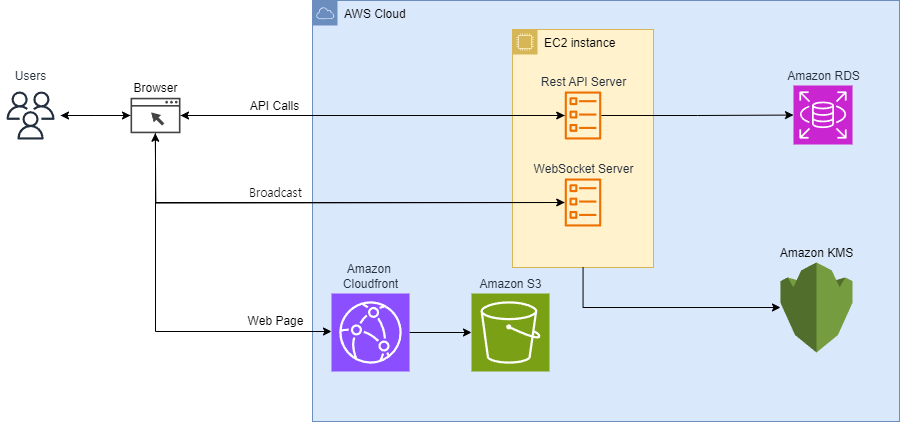

# Catch Mind(Web version)


## Proposal
기존 캐치마인드(Catch Mind) 게임은 windows 데스크탑 어플리케이션을 기반으로 2001년 11월 출시된 게임 서비스이다. 이후 Android, IOS 모바일 어플리케이션 버전으로 2019년 8월 재출시되었다. 기존 낮은 동시 접속자 수를 유지하던 데스크탑 버전의 게임이 사용자 접근성을 향상시킴으로써 플레이스토어 1위를 기록할 정도의 인기를 얻을 수 있었다.
이를 통해 데스크탑 어플리케이션, 모바일 어플리케이션 외에 웹 어플리케이션으로도 개발한다면 신규 사용자 유입에 큰 영향이 있을것으로 생각되어 본 프로젝트를 기획한다.

## Design




```bash
docker run --name mysql-container -p 3306:3306 -e MYSQL_ROOT_PASSWORD=1234 -d mysql
```